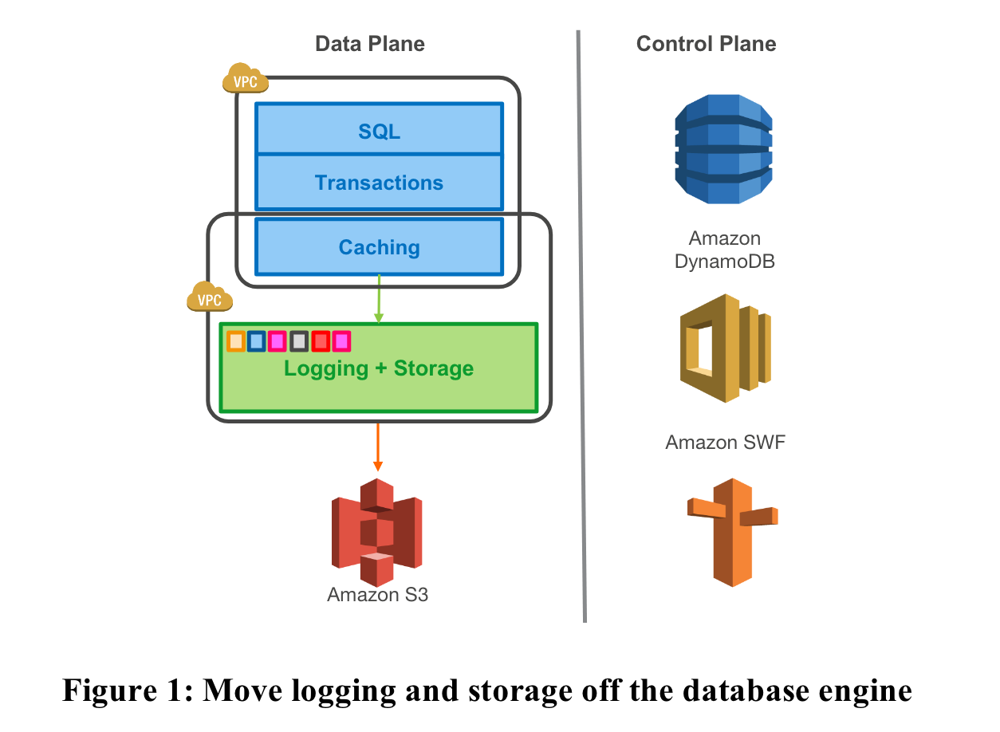
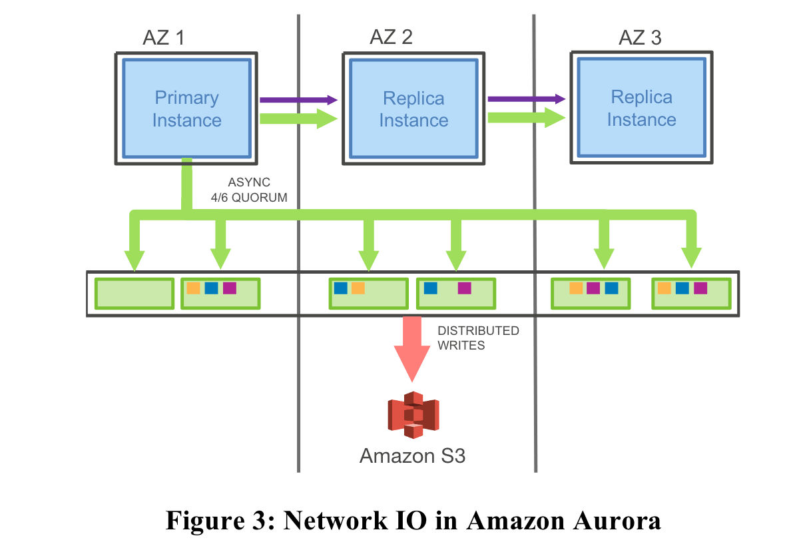
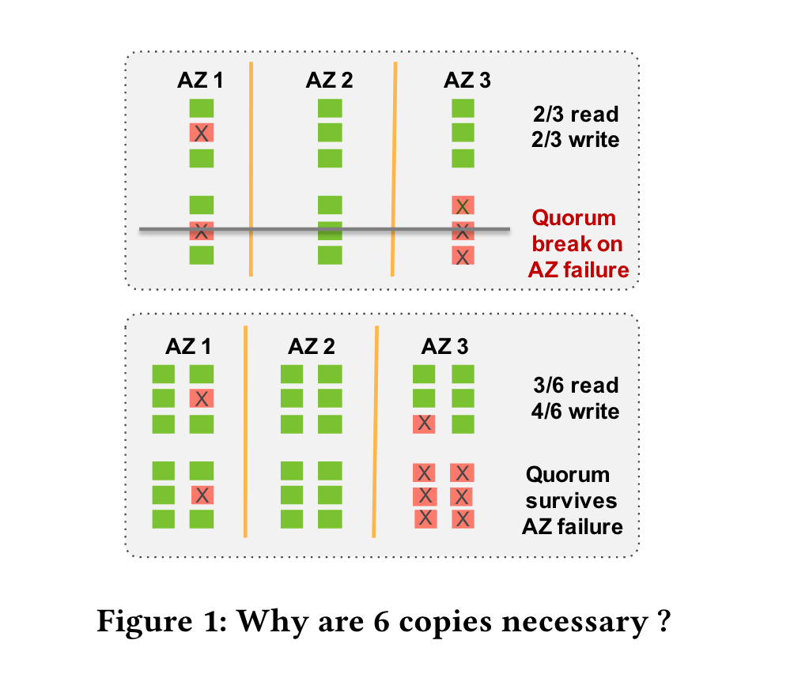
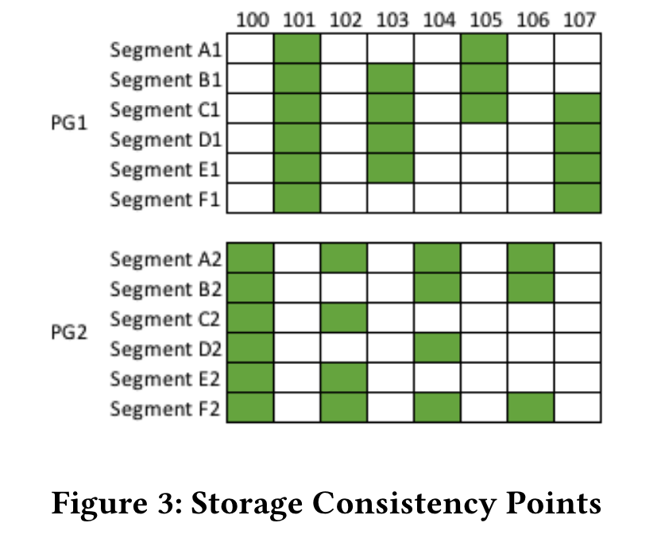
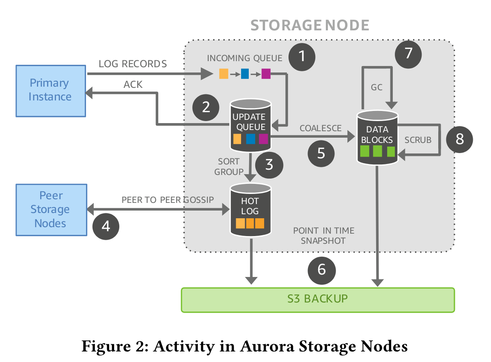

# Amazon Aurora

Amazon Aurora, a new database service that addresses the above issues (the problem about 2PC) by more aggressively leveraging the redo log across a highly-distributed cloud environment. 

We use a novel service-oriented architecture (see Figure 1) with a multi-tenant scale-out storage service that abstracts a virtualized segmented redo log and is loosely coupled to a fleet of database instances. 

* Computer tier includes most of the components of a traditional kernel (query processor, transactions, locking, buffer cache, access methods and undo management) ；

* Storage tier includes several functions (redo logging, durable storage, crash recovery, and backup/restore) ；

## 1. Architecture

In Aurora：

* **Computer tier**(Primary Instance): the only writes that cross the network are redo log records. No pages are ever written from the database tier, not for background writes, not for checkpointing, and not for cache eviction. Instead, the log applicator is pushed to the storage tier where it can be used to generate database pages in background or on demand. 

* **Storage tier**: generating each page from the complete chain of its modifications from the beginning of time is prohibitively expensive. We therefore continually materialize database pages in the background to avoid regenerating them from scratch on demand every time. Note that background materialization is entirely optional from the perspective of correctness: as far as the engine is concerned, the log is the database, and any pages that the storage system materializes are simply a cache of log applications. 

  The IO flow batches fully ordered log records based on a common destination (a logical segment, i.e., a PG) and delivers each batch to all 6 replicas where the batch is persisted on disk and the database engine waits for acknowledgements from 4 out of 6 replicas in order to satisfy the write quorum and consider the log records in question durable or hardened. 

* **replica instances**: In this model, the primary only writes log records to the storage service and streams those log records as well as metadata updates to the replica instances. The replicas use the redo log records to apply changes to their buffer caches.

### 1.1 Compute tier

We use a novel service-oriented architecture (see Figure 1) with a multi-tenant scale-out storage service that abstracts a virtualized segmented redo log and is loosely coupled to a fleet of database instances. In Computer tier, We need to consider four aspects of ACID transactions.

* Atomicity: the redo-undo process remains the same. the undo page and data page can be generated by redo log stream in storage tier;
* Consistency[1]: the constrains remains unchanged. these constrains only relative with computer tier;
* Isolation: In Replica Instance,  consistent reads[6] require the replica to construct the read snapshot;
* Durability: At Transaction commit, the redo log is require to persistented in Storage tier;

In addition, we need consider the ablity of Scalability , high availability and performance:

* Scalability: Dynamically registering replica instances up to 15.
* High availability: use Zero Down time Patch (ZDP) to support upgraded and the primary instance can selected by control plane without election in raft and paxos.
* Performance: (1) ignore to execute log checkpoint and write dirty page. (2) the speed of redo writing is very important.

### 1.2 Storage tier

If a database system does nothing else, it must satisfy the contract that data, once written, can be read. Not all systems do. In this section, we discuss the rationale behind our quorum model, why we segment storage, and how the two, in combination, provide not only durability, availability and reduction of jitter, but also help us solve the operational issues of managing a storage fleet at scale.

**Replication**

**The problem to be solved by replication**：Instance lifetime does not correlate well with storage lifetime. Instances fail. Customers shut them down. They resize them up and down based on load. For these reasons, it helps to decouple the storage tier from the compute tier.

To provide high availability and withstand the following two types of failures, We therefore must be replicated in some form to provide resiliency to failure.

1. background noise failures: disk and network path failures;
2. AZ failure: the AZ  failure , due to a fire, roof failure, flood, etc;

**The solution to be adopted in replication**：One approach to tolerate failures in a replicated system is to use a **quorum-based voting protocol** as described in [6]. In Aurora, we have chosen a design point of tolerating

* (a) losing an entire AZ and one additional node (AZ+1) without losing data, and
* (b) losing an entire AZ without impacting the ability to write data. 

We achieve this by replicating **each data item 6 ways across 3 AZs with 2 copies of each item in each AZ**. We use a quorum model with 6 votes (V = 6), a write quorum of 4/6 ($V_w = 4$), and a read quorum of 3/6 ($V_r = 3$).  With such a model, we can

* (a) lose a single AZ and one additional node (a failure of 3 nodes) without losing read availability, and 
* (b) lose any two nodes, including a single AZ failure and maintain write availability. Ensuring read quorum enables us to rebuild write quorum by adding additional replica copies.

**Sharding**

**The problem to be solved by Sharding**：To provide sufficient durability in this model, one must ensure the probability of a double fault on uncorrelated failures (Mean Time to Failure – MTTF) is sufficiently low over the time it takes to repair one of these failures (Mean Time to Repair MTTR). If the probability of a double fault is sufficiently high, we may see these on an AZ failure, breaking quorum. It is difficult, past a point, to reduce the probability of MTTF on independent failures. **We instead focus on reducing MTTR to shrink the window of vulnerability to a double fault**.

**The solution to be adopted in Sharding**：We do so by **partitioning the database volume into small fixed size segments, currently 10GB in size**. These are each replicated 6 ways into Protection Groups (PGs) so that each PG consists of six 10GB segments, organized across three AZs, with two segments in each AZ.

hwo to decrease MTTR：**Segments are now our unit of independent background noise failure and repair**. We monitor and automatically repair faults as part of our service. A 10GB segment can be repaired in 10 seconds on a 10Gbps network link.

==*TODO: Why Sharding ?*==

The combination of distributed protocols and sharding strategies can be traced back to Spanner's Paxos group; **relevant papers should be reviewed**. The main purposes of its sharding design are as follows. We need to quantitatively analyze the benefits these bring:

- **Improve Scalability**: If each machine acts as a Raft node, the system’s scalability will degrade. For example, in a 3-node Raft group with 3 replicas, if you want to add a fourth node, it is not possible — you cannot scale capacity to 1.33x.
- **Reduce Fault Domain Impact (Fault Isolation)**: A single Raft group failure won't affect the entire system.
- **Optimize Resource Utilization (Resource Efficiency), or Load Balancing**: Leaders and followers are evenly distributed across different nodes.
- **Adapt to Data Locality**

**HA**

Since our system has a high tolerance to failures, we can leverage this for maintenance operations that cause segment unavailability. For example, 

* heat management is straightforward. We can mark one of the segments on a hot disk or node as bad, and the quorum will be quickly repaired by migration to some other colder node in the fleet. 
* OS and security patching is a brief unavailability event for that storage node as it is being patched. 
* Even software upgrades to our storage fleet are managed this way. We execute them one AZ at a time and ensure no more than one member of a PG is being patched simultaneously.

 This allows us to use agile methodologies and rapid deployments in our storage service.

## 2. Execute Path

### 2.1 Write Path

#### Compute tier

**Firstly, the log structure changes**: Each log record stores the LSN of the preceding log record in the volume, the previous LSN for the segment, and the previous LSN for the block being modified. The block chain is used by the storage node to materialize individual blocks on demand. The segment chain is used by each storage node to identify records that it has not received and fill in these holes by gossiping with other storage nodes. The full log chain is not needed by an individual storage node but provides a fallback path to regenerate storage volume metadata in case of a disastrous loss of metadata state.

**Secondly, Asynchronously write:**  Asynchronously  send redo log, receives acknowledgments, and establishes consistency points.

**Thirdly, Group Writes**: Many database systems boxcar redo log writes to improve throughput. There is a challenge in deciding, with each record, whether to issue the write, to improve latency, or to wait for subsequent records, to improve write efficiency and throughput. Waiting creates performance jitter since early requests entering the boxcar have to wait for later requests or a timeout to fill the request. Jitter is greatest under low load when the boxcar times out.

In Aurora, there are many segments partitioning the redo log and the opportunity to boxcar are lower than with a single unsegmented redo log. Aurora handles this by submitting the asynchronous network operation when it receives the first redo log record in the boxcar but continuing to fill the buffer until the network operation executes. This ensures requests are sent without boxcar latency and jitter while packing records together to minimize network packets.

**Consistency with transaction and redo log**

**the Storage Consistency Points:** Here we claritify some concept, Figure 3 shows a database with two protection groups, PG1 and PG2, consisting of segments A1-F1 and A2-F2 respectively.

* SCL(Segment Complete LSN) : In a single segment.  representing the latest point in time for which it knows it has received all log records in a segment. For example: the SCL of Segment A1 is 101 but the Segment B1 is 105;
* PGCL(Protection Group Complete LSN) : In a PG. representing the point at which the protection group has made all writes durable. For example: the PGCL of PG1 is 103 and PG2 is 104. Because before this, all logs have been mostly written;
* VCL (Volume Complete LSN): In a volumn. once there are no pending writes preventing PGCL from advancing for one of its protection groups. For example the VDL is 103;

Relative SCL: 

* SCL (Consistency Point LSN): (1) Each database-level transaction is broken up into multiple mini-transactions (MTRs) that are ordered and must be performed atomically. (2) Each mini-transaction is composed of multiple contiguous log records (as many as needed). (3) The final log record in a mini-transaction is a CPL.

* VDL(Volume Durable LSN): the highest CPL that is smaller than or equal to VCL and truncate all log records with LSN greater than the VDL
* SCN(System Commit Number): the last LSN of a transaction commit;

#### Storage tier

**Firstly, Storage Architecture**: The activities on the storage node are shown in more detail in Figure 2. Foreground activity in a storage node consists of 

* (1) receiving redo records,
*  (2) writing them to an update queue, and acknowledging them back. In background, the storage node 
* (3) sorts and groups records,
*  (4) gossips with peers to fill in missing records, 
* (5) coalesces them into data blocks, 
* (6) backs them up to Amazon Simple Storage Service (S3), 
* (7) garbage collects backed-up data that will no longer be referenced by an instance, and
* (8) periodically scrubs data to ensure checksums continue to match the data on disk.

**Secondly, Crash Recovery in Storage** : Make sure the VCL, recovery by the following sequence: `SCL(for Segment)-->PGCL(for rotection Group)-->VCL(for volumn)`;

2. use quorum read to make sure the PGCL;
2. compute the VCL from PGCL;
3. use read quorum to repair the segment log lower than VCL and cleanup the segment log greater than VCL;
4. Whether redo crash recovery should be performed?
5. Once the volume is available for reads and writes(), Aurora increments an epoch in its storage metadata service and records this volume epoch in a write quorum of each protection group comprising the volume to refuse requests at stale volume epochs.

==TODO: the crash recovery difference between compute tier and storage tier ?==

### 2.2 Read Path

#### Compute tier

**Firstly, Avoiding quorum reads**

Problem1: How to set the read lsn?

We use read lsn to request the page, but the request way have some differences:

1. In master: the read lsn is the VDL or eviction LSN (for buffer pool part or PG), but the range page: [evict LSN, VDL] has in the BP;
2. In slave: the read lsn is the lastest received mtr lsn;

Problem2: How to select the segment in PG? 

We manage this by tracking response time from storage nodes for read requests. The database instance will usually issue a request to the segment with the lowest measured latency, but occasionally also query one of the others in parallel to ensure up to date read latency response times.

**Secondly,  Scaling Reads Using Read Replicas(how to replica with replicas)**

1. Both synchronous and asynchronous replication have undesirable characteristics. Synchronous replication introduces performance jitter and failure modalities in the write path. Asynchronous replication introduces data loss on failure of the writer.

2. Logical replica: Supports logical replication to communicate with nonAurora systems and in cases where the application does not want physical consistency;

3. Physical replica: Aurora read replicas attach to the same storage volume as the writer instance.They receive a physical redo log stream from the writer instance and use this to update only data blocks present in their local caches. In addition, the the replica also can be promoted to a write instance.

   

   

**Thirdly, Structural Consistency in Aurora Replicas(how to replay the control object in replica)**

Aurora uses three invariants to manage replicas. 

1. First, replica read views must lag durability consistency points at the writer instance. This ensures that the writer and reader need not coordinate cache eviction. 
2. Second,(*replay the B+ tree changes in replica*.) structural changes to the database, for example B-Tree splits and merges, must be made visible to the replica atomically. This ensures consistency during block traversals. 
   * Ref[8];
   * image the picture(consistency view): the SMO write like a write thread in RO, we need to *reconstruct the write process* in RO;
   * We don’t consider the SMO mtr, directly get page by request from  storage tier (the write amplification is 1/2);
   * Like Bw Tree , the redo log is append in the page, and access will parse the redo log;
3. Third, (*replay the read views changes in replica*.)read views on replicas must be anchorable to equivalent points in time on the writer instance. 

#### Storage tier

For storage tier, it need to be ensured that the PG need maintain lowest water version page and relative redo log in Durable Storage Device. There exists some optimization aimed to quickly supply the page what the compute tier need.

1. Use multi-thread to replay the lowest water version page to the version that the compute tier point in order to meet  multiple request simultaneously.
2. Use multi-version page to build Intermediate version to accelerate page replay process.
3. Build the replay priority page repaly, (1). Increase the priority of certain index playbacks; (2). Perceive the user SQL.

The  lowest water also is PGMRPL.

## 2.3 Recovery Path

## 2.4 DDL Path

## Ref

1. AWS re:Invent 2024 - Deep dive into Amazon Aurora and its innovations  https://www.youtube.com/watch?v=kVVdHezNTpw

   AWS re:Invent 2023: https://www.youtube.com/watch?v=je6GCOZ22lI

   AWS re:Invent 2022: https://www.youtube.com/watch?v=pzZydB78Eyc

   AWS re:Invent 2021 - Deep dive on Amazon Aurora  https://www.youtube.com/watch?v=SEXbvl2oQGs

   AWS re:Invent 2020: Amazon Aurora storage demystified   https://www.youtube.com/watch?v=0IeLKyBl3CM , https://www.youtube.com/watch?v=w9jrgCTsRBU

   AWS re:Invent 2019: [REPEAT 1] Deep Dive on Amazon Aurora with MySQL Compatibility https://www.youtube.com/watch?v=GwEtiRZR4g4

   AWS re:Invent 2018: https://www.youtube.com/watch?v=U42mC_iKSBg

   AWS re:Invent 2017: Getting Started with Amazon Aurora  https://www.youtube.com/watch?v=DAJhvRMniqo

   AWS re:Invent 2016: Deep Dive on Amazon Aurora  https://www.youtube.com/watch?v=duf5uUsW3TM

   AWS re:Invent 2015 | (DAT207) Amazon Aurora: The New Amazon Relational Database Engine https://www.youtube.com/watch?v=hpWpBVdY8Ss

   AWS re:Invent 2014 | Announcing Amazon Aurora for RDS  https://www.youtube.com/watch?v=GRm1fA42Z58

2. https://en.wikipedia.org/wiki/Consistency_(database_systems)

3. Amazon Aurora: Design Considerations for High Throughput Cloud-Native Relational Databases.

4. Amazon Aurora: On Avoiding Distributed Consensus for I/Os, Commits, and Membership Changes.

5. locking reads: https://dev.mysql.com/doc/refman/8.0/en/innodb-locking-reads.html

6. consistent reads: https://dev.mysql.com/doc/refman/8.0/en/innodb-consistent-read.html

7. Taurus: https://km.woa.com/articles/show/459135

8. Polar SMO optimization: https://baotiao.github.io/2024/03/12/polardb-sync-counter.html

