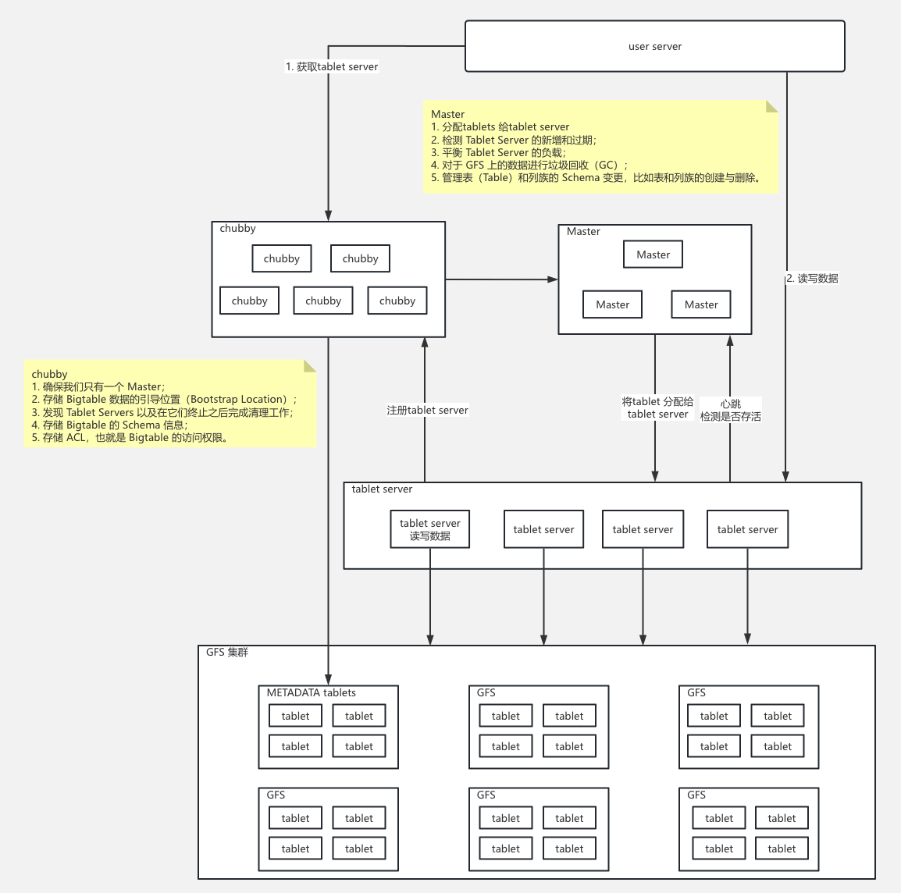

# Bigtable: A Distributed Storage System for Structured Data

Bigtable is designed to reliably scale to petabytes of data and thousands of machines. Bigtable has achieved several goals: wide applicability, scalability ,high performance, and high availability.

# 0 Input/output

## 1.1 Data Model

A Bigtable is a sparse, distributed, persistent multidimensional sorted map. The map is indexed by a row key,column key,and a timestamp; each value in the map is an uninterpreted array of bytes.
$$
\mathrm{(row:string, column:string, time:int64)\rightarrow string }
$$


We settled on this data model after examining a variety of potential uses of a Bigtable-lik esystem. As one concrete example that drove some of our design decisions, suppose we want to keep a copy of a large collection of web pages and related information that could be used by many different projects; let us call this particular table the *Webtable*. In Webtable, we would use URLs as row keys, various aspects of web pages as column names, and store the contents of the web pages in the **contents**: column under the timestamps when they were fetched, as illustrated in Figure 1.

### Rows

The rowkeys in atable are arbitrary strings (currently up to 64KB in size, although 10-100 bytes is a typical size for most of our users). For example: in Webtable, pages in the same domain are grouped together into contiguous rows by reversing the hostname components of the URLs.

For example, we store data for `maps.google.com/index.html` under the key `com.google.maps/index.html`.Storing pages from the same domain near each other makes some host and domain analyses more efficient.

### Column Families

Column keys are grouped into sets called column families, which form the basic unit of access control.  A column key is named using the following syntax: `family:qualifier`.  

An example column family for the Webtable is language,which stores the language in which a web page was written. We use only one column key in the language family,and it stores each web page’s language ID. 

Another useful column family for this table is anchor; each column key in this family represents a single anchor,as shown in Figure 1. The qualifier is the name of the referring site; the cell contents is the link text.

### Timestamps

Each cell in a Bigtable can contain multiple versions of the same data; these versions are indexed by timestamp. 

For example, In our Webtable example, we set the timestamps of the crawled pages stored in the contents: column to the times at which these page versions were actually crawled. The garbage-collection mechanism described abovelets us keep only the most recent three versions of every page.


## 1.2 API

The Bigtable API provides functions for creating and deleting tables and column families. It also provides functions for changing cluster,table, and column family metadata, such as access control rights

Example1: Writing to Bigtable. Uses a RowMutation abstraction to perform aseries of updates

```java
//Open thetable 
Table *T=OpenOrDie("/bigtable/web/webtable");

//Write a new anchor and delete an old anchor 
RowMutation r1(T, "com.cnn.www"); 
r1.Set("anchor:www.c-span.org", "CNN"); 
r1.Delete("anchor:www.abc.com"); 
Operation op; 
Apply(&op, &r1);
```

Example2: Reading from Bigtable. Uses a Scanner abstraction to iterate over all anchors in aparticular row

```java
Scanner scanner(T); 
ScanStream *stream; 
stream = scanner.FetchColumnFamily("anchor"); 
stream->SetReturnAllVersions();
scanner.Lookup("com.cnn.www"); 
for(;!stream->Done(); stream->Next()) {
  printf("%s %s%lld %s\n", 
         scanner.RowName(), 
         stream->ColumnName(), 
         stream->MicroTimestamp(), 
         stream->Value()); 
}
```


# 1  Architecture


As above architecture picture:

* **Clients** communicate directly with tablet servers for reads and writes. Because Bigtable clients do not rely on the master for tablet location information, most clients nevercommunicate with the master.As aresult, the master islightly loaded in practice.
* Each node (**tablet server**) in the cluster handles a subset of the requests to the cluster. By adding nodes to a cluster, you can increase the number of simultaneous requests that the cluster can handle.

* If you enable replication by adding additional clusters, you can also send different types of traffic to different clusters. Then if one cluster becomes unavailable, you can fail over to another cluster.

*  Tablets are stored on Colossus (**Google's file system**), in SSTable format. An SSTable provides a persistent, ordered immutable map from keys to values, where both keys and values are arbitrary byte strings. Each tablet is associated with a specific Bigtable node. In addition to the SSTable files, all writes are stored in Colossus's shared log as soon as they are acknowledged by Bigtable, providing increased durability.

Two Extra role:

* **Chubby**: Bigtable uses Chubby for avariety of tasks:  to ensure that there is at most one active master at anytime;  to store the bootstrap location of Bigtable data (see Section 5.1);  to discover tablet and finalize ablet server deaths (see Section 5.2) to store Bigtable schema information (the column family information for each table);  to store access control lists. 
* **Master**:  The master isresponsible for  (1) assigning tablets to tablet servers, (2)  detecting the addition and expiration of tablet servers, (3) balancing tablet-server load, and garbage collection of files in GFS. (4) In addition, it handles schema changes such as table and column family creations.



# 2 Execute Path

## 2.1 Tablet and Tablet server

First, BigTable use a three-level hierarchy analogous to that of a B +tree [10] to store tablet location information (Figure 4).


**Location Tablet Process:** need three network round-trips

1. **`Chubby file --> Root tablet: `** The  first level is a file stored in Chubby that contains the location of the root tablet. 
2. **`Root tablet --> METADATA tables:`** The root tablet contains the location of all tablets in a special METADATA table. The root tablet is just the first tablet in  the METADATA table,  but is treated specially  --- it is never split -- to ensure that the tablet location hierarchy has no more than three levels.
3. **`METADATA tables -->  UserTablets:`** (*Here, the UserTable1 should be fixed as UserTablet*) The METADATA table stores the location of a tablet under a row key that is an encoding of the tablet’s table identier and its end row.

If the client’s cache is stale, we need six round-trips, the extra three round-trips is:

1. **`Stale UserTablets Info:`** the current tablet information is stale. So, we use cached METADATA tables info to locate the User Tables.
2. **`Stale METADATA tables Info:`** the current METADATA tables is stale. So, we use Cached Root tablet info to lcate the METADATA Tables.
3. **`Stale Chubby file:`** The current METADATA tables is stale. So, we reprocess the Location Process.


Throught the previous process, we need to get the Tablet Server to process the client request.

**Location Tablet Server Process:** 

1. The master executes the following steps at startup.

   - (1) The master grabs aunique master lock in Chubby, which prevents concurrent master instantiations. 
   - (2) The master scans the servers directory in Chubby to find the live servers.
   - (3) The master communicates with every live tablet server to discover what tablets are already assigned to each server.
   - (4) This addition ensures that the root tablet will be assigned. Because the root tablet contains the names of all METADATA tablets, the master knows about all of them after it has scanned the root tablet.
   - (5) The master scans the METADATA table to learn the set of tablets. Whenever this scan encounters a tablet that is not already assigned, the master adds the tablet to the set of unassigned tablets.

   So, the record of  METADATA tablets contains the tablet server address

   ```c++
   Tablet id | Tablet address | Tablet server address |
   ```

   Here in the `hbase:meta` table，Region Server address is stored in **the `server` column of the `info` column family**：

   | **column family** | **column (Qualifier)** | **storage content**    | **example value**                         |
   | :------- | :----------------------- | :-------------------------------- | :--------------------------------- |
   | `info`   | `server`                 | **RegionServer host address and port** | `regionserver-1.example.com:16020` |
   | `info`   | `serverstartcode`        | RegionServer process start timestamp     | `1698765432100`                    |

2. If the “Tablet server address” don’t contain the address. 

   - The master is responsible for detecting when a tablet server is no longer serving its tablets, and for reassigning those tablets as soon as possible.

   * In case the split nodification is lost, he master detects the newtablet when itasks atablet server to load the tablet that has nowsplit. The tablet serverwill notify the master of the split, because the tablet entry it ends in the METADATA table will specify only aportion of the tablet that the master asked itto load.

3. The Bigtable client cache address of root tablet, METADATA tablet and request target tablets


## 2.2 Write and Read Path

The persistent state of a tablet is stored in GFS, as illustrated in Figure 5. The Read and Write is processed by Tablet Server. the Process is like LSM-tree Read and Write.


**Refinements about write and read**

1. Locality groups: Clients can group multiple column families together into a locality group.A separate SSTable is generated for each locality group in each tablet. it has following use:

   * Lazily loaded some big columns: `[base_info: [name, age], full_info: [address, favorite]]`，some query: `select address  where name = 'xxx1 and address = 'xxx2’`， we can use condition `name = 'xxx1’` to filter some row to lazily load the `full_info` column famility.
   * Implement the single row transaction.

2. Compression: Manyclients use atwo-pass custom compression scheme.

   * The first pass uses Bentley and McIlroy’s scheme [6],which compresses long common strings across a large window.
   * The second pass uses a fast compression algorithm that looks for repetitions in a small 16 KB window of the data.

3. Tablet servers use two levels of caching. 

   - The Scan Cache isa higher -level cache that caches the key-value pairs returned by the SSTable interface to the tablet server code.

     The Scan Cache ismost useful for applications that tend to read the same data repeatedly.

   - The Block Cache is a lower-level cache that caches SSTables blocks that were read from GFS.

     The Block Cache is useful for applications that tend to read data that is close to the data they recently read (e.g., sequential reads, or random reads of different columns in the same locality group within a hot row).

4. Bloom filters

5. log group commit

   we append mutations to asingle commit log per tablet server,co-mingling mutations for different tablets in the same physical log file[18,20]. 

   * avoid duplicating log reads by first sorting the commit log entries in order of the keys :`<table, row name, log sequence number>`. To parallelize the sorting, we partition the log file into 64MB segments ,and sort each segment in parallel on different tablet servers.
   * To protect mutations from GFS latency spikes, each tablet server actually has two log writing threads, each writing to its own log file; only one of these two threads is actively in use at a time.

6. Speeding up tablet recovery

   If the master moves a tablet from one tablet server to another,the source tablet server first does a minor compaction on that tablet.This compaction reduces recovery time by reducing the amount of uncompacted state in the tablet server'scommit log.

7. Exploiting immutability
   * To reduce contention during reads of the memtable, we make each memtable row copy-on-write and allow reads and writes to proceed in parallel.
   * The master removes obsolete SSTables as a mark-and-sweep garbage collection [25]. over the set of SSTables, where the METADATA table contains the set of roots.
   * The immutability of SSTables enables us to split tablets quickly.Instead of generating a new set of SSTables for each child tablet, we let the child tablets share the SSTables of the parent tablet.

# 3 Performance and Lessons

Lesson:

1. One lesson we learned is that large distributed systems are vulnerable to many types of failures, not just the standard network partitions and fail-stop failures assumed in many distributed protocols.

2. Another lesson we learned is that it is important to delay adding new features until it is clear how the new features will be used.

3. A practical lesson that we learned from supporting Bigtable is the importance of proper system-level monitoring (i.e., monitoring both Bigtable itself, as well as the client processes using Bigtable).

4. The most important lesson we learned is the value of simple designs.


# Ref

1. https://cloud.google.com/bigtable/docs/overview
2. https://www.slideshare.net/slideshow/undestand-google-bigtable-is-as-easy-as-playing-lego-bricks-lecture-by-romain-jacotin/40245561
3. https://www.processon.com/view/61dab5d60e3e74415771dfbc


