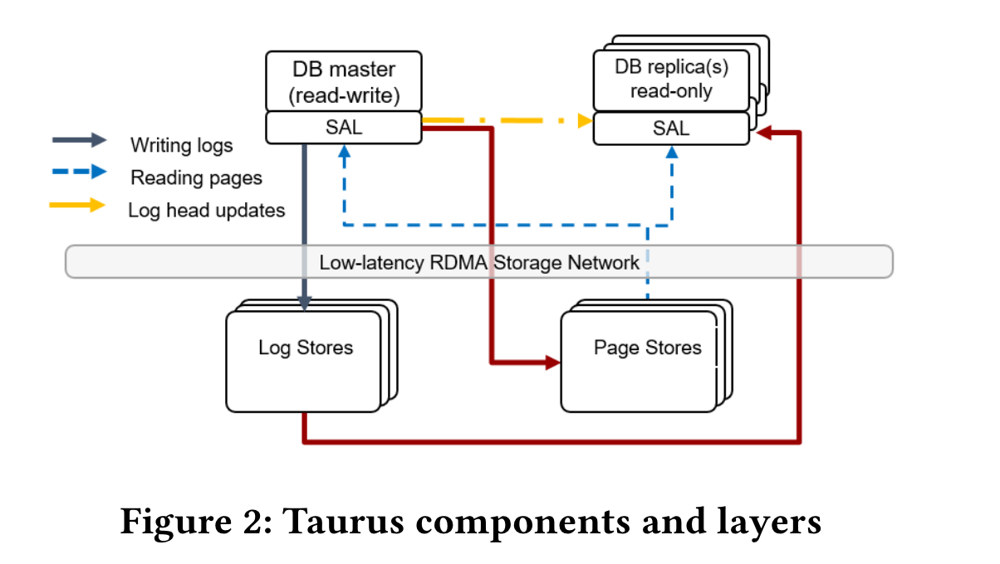
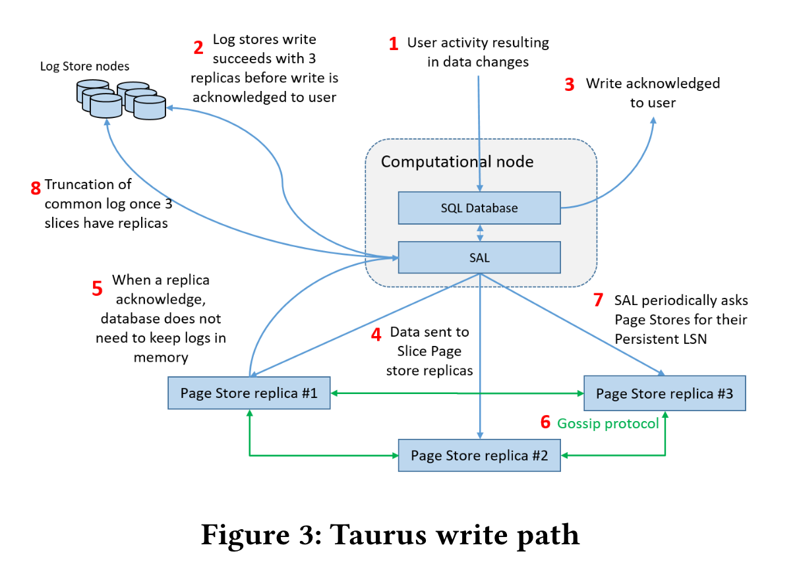
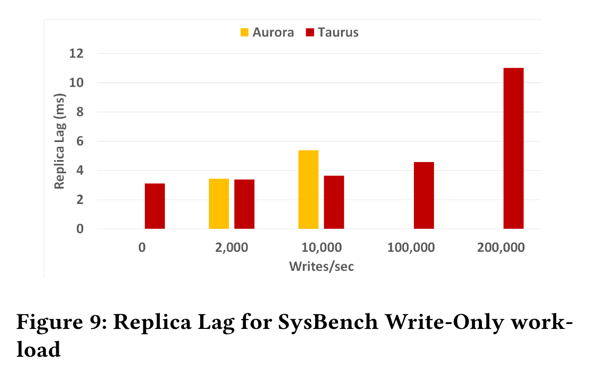

# Taurus Database: How to be Fast, Available, and Frugal in the Cloud

To prevent the storage layer from becoming a bottleneck, Taurus enhances its performance in two key ways:

- **Separating Log Stores from Page Stores** to (1) reduces the load on Page Stores ;(2) simplified the log distribution mechanism in the compute layer; (3) Reduce bandwidth and CPU consumption caused by redo transport on read-write instances.
- **Restructuring Page Stores** around a "log-as-database" model, eliminating in-place modification and using append-only writes.

# 1 Architecture

In Taurus:

* The compute tier:  Database (DB) & Storage Abstraction Layer (SAL)

  * DB: MySQL or PostgreSQL
  * SAL Responsibilities:
    * Manages slices in Page Stores: creating, managing, and destroying slices in Page Stores and mapping pages to the slices;
    * Writes log records to Log Stores and Page Stores *(replaces VDL with CV-LSN);*
    * Reads pages from Page Stores;

* The storage tier: Log Stores & Page Stores

  * The Log Stores(PLogs):

    * writes to Log Stores will always succeed as long as there are at least three healthy hosts available in the cluster;
    * database read-only replicas read the log records recently written by the master replica.
    * reads log records during database recovery when committed log records must be read and sent to Page Stores.

  * The Page Stores consist Slices(10G per slices):

    * (1) `bool WriteLogs(Slice id, Log *records)` is used to ship a buffer with log records
    * (2) `bool ReadPage(Slice id, LSN version, Data *pages)` is used to read a specific version of a page 
    * (3) `bool SetRecycleLSN(Slice id, LSN recycle)` is used to specify the oldest LSN of pages belonging to the same database that the front end might request (recycle LSN) 
    * (4) **`LSN GetPersistentLSN(Slice id)`** returns the highest LSN that the Page Store can serve and the log behind this LSN can be purge;

    

# 2. Execute Path

It primarily focuses on the differences with Aurora.

## 2.1 Write Path

The Different compare aurora: The separetion of Log and Page led the the 1,2,3 is sync and 4,5,6,7,8 is async;

advantage:

1. Reduce the pressure of page store  compare to aurora;
2. Don’t translate the redo log into slice id and drectly write the log servers;

disadvantage:

1. promote the cost;
2. don’t mention that whether the log store is distributed in 3 AZs ? and No description of its disaster recovery capabilities.

**Differences Compared to Aurora:**
The separation of Log and Page enables a hybrid approach: operations 1-3 are synchronous, while 4-8 are asynchronous.

**Advantages:**

1. Reduces page storage pressure compared to Aurora.
2. Eliminates redo log translation by writing directly to log servers without converting to slice IDs.

**Disadvantages:**

1. Higher operational costs.
2. Lacks critical documentation: No confirmation of 3-AZ distributed log storage and no description of disaster recovery capabilities.

## 2.2 Read Path

**The Key Difference is maily focus on the Compute Tier Implementation:**

**Master Node Process:**

1. For each slice, the Storage Abstraction Layer (SAL) tracks the last Log Sequence Number (LSN) sent to that slice.
2. Whenever the master node reads a page, the read goes to the SAL, which issues a read request accompanied by the above LSN.
3. Requests are routed to the lowest-latency Page Store replica.
4.  If the chosen Page Store is unavailable or did not receive all log records up to the provided LSN, an error is returned, and SAL tries the next Page Store hosting the desired page, iterating through the replicas until it finds one that can execute the request.

**Read Replica Process:**

1. Continuously parses log streams from Log Stores, detects log record group boundaries, and advances its visible LSN.
2. When a read transaction needs to access pages, it creates its own physical view of the database by recording the current replica visible LSN, called a transaction visible LSN (TV-LSN).
3. Tracks the minimum TV-LSN across transactions and reports it to the master. The master computes the global minimum and propagates it to Page Stores as the new recycle LSN.
4. Maintains multiple page versions in its buffer pool. Applies incoming log records to generate newer page versions locally, reducing Page Store load by caching frequently accessed pages.

## 2.3 Recovery 

**Storage Tier Recovery:**
First, recover the storage tier. For deployments using local storage solutions in Log/Page Stores, leverage the native recovery capabilities of these platforms:

- Log Stores: Verify integrity of all persisted redo logs and initialize read servers.
- Page Stores:
  1. Validate slice health
  2. Replicate missing redo logs from Log Servers via gossip protocol
  3. Execute redo recovery

**Compute Tier Recovery:**
The compute tier (MySQL frontend + SAL) recovers as follows:

- SAL: Aggregates slice metadata and computes the Consistency Vector LSN (VDL) using persisted LSNs.
- MySQL Frontend: Performs remaining recovery operations using Aurora's methodology.

# 3. Problem

**Core Problem Statements:**

1. Persistent metadata management for Page Servers
2. Availability Zone (AZ) failure resilience
3. Multi-version page management in MySQL frontend's buffer pool

# 4. EXPERIMENTAL EVALUATION

**Comparison with Amazon Aurora：**

* In the read-only test the difference is small (16%), but in the write-only benchmark, the Taurus advantage is more than 50% - and reaches 160% in TPC-C.

* Taurus demonstrates good workload scalability even when the master executes heavy workloads up to 200,000 writes per second. At this utilization level, the replica lag is below 11ms, which is small enough for many applications. The Aurora authors do not provide data above 10,000 writes per second.

  

**Comparison with Optimization MySQL：**

Taurus is 9% slower than the optimized version of MySQL with locally attached storage due to the higher network latency of the remote storage. On the write-only and TPC-C workloads, our architectural changes allow Taurus to outperform the optimized MySQL by 87% and 101%, respectively.
