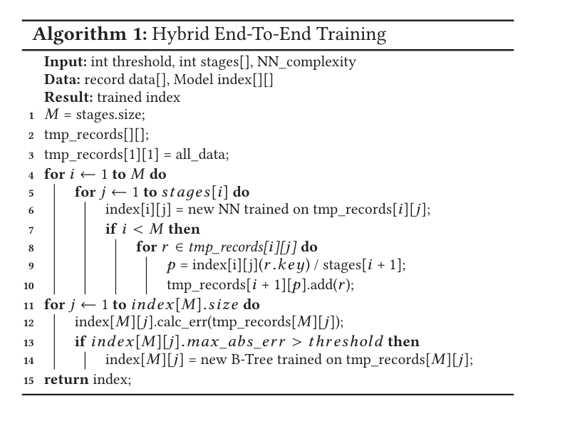
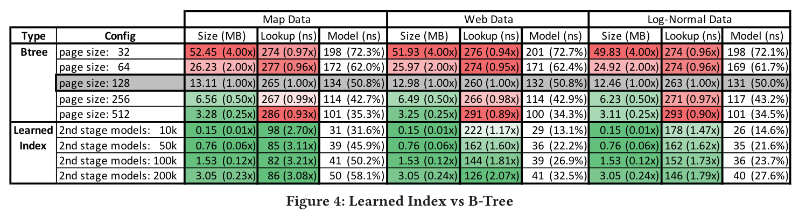

# The Case for Learned Index Structures

Kraska, Tim, Alex Beutel, Ed H. Chi, Jeffrey Dean, and Neoklis Polyzotis. “The Case for Learned Index Structures.” In *Proceedings of the 2018 International Conference on Management of Data*, 489–504, 2018.


**2 RANGE INDEX**

* Hypothesis: Range index structure, like B-Trees, are already models: given a key, they “predict” the location of a value within a keysorted set. To see this, consider a B-Tree index in an analytics in-memory database (i.e., read-only) over the sorted primary key column as shown

**3 THE RM-INDEX**

* 3.1 learning index framework (LIF)
  * Use: LIF generates different index configurations, optimizes them, and tests them automatically
  * method: given a trained Tensorflow model, LIF automatically extracts all weights from the model and generates efficient index structures in C++ based on the model specification. ref[25]
  * additional overhead: quickly evaluate different index configurations (e.g., ML models, page-sizes, search strategies, etc.)
  
* 3.2 recursive-model indexes (**RMI**)

  Based on that observation and inspired by the mixture of experts work [62], we propose the recursive regression model (see Figure 3)

  

  * **RMI description:** We assume at stage $\ell$, there are $M_{\ell}$ models （For example, there 4 models in stage3 above）.We train the model at stage 0. (There is a problem with the stage identification above, It should be fixed as : stage 0, stage 1, stage 2)

  * **Model Input and output**:  for our model $f(x)$ where $x$ is the $key$ and $y\in [0 ,N]$ the position

  * **Model identification  description**: The model $k$ in stage $\ell$ is denoted as $\mathrm{Model}\; \ell.k$ above Figure 3 and the model is also denoted by $f_{\ell}^{(k)}(x)$, At stage 0, the model of $\mathrm{Model\; 0.0}$ is $f_0(x)$

  * **Model loss function**:
    $$
    L_{\ell} = \sum_{(x,y)}(f_{\ell}^{\lfloor M_{\ell}f_{\ell -1}(x)/N \rfloor} (x) - y)^2 
    \qquad
    L_{0} = \sum_{(x,y)}(f_{0}(x) - y)^2
    $$
    Note here the notation of $f_{\ell - 1}(x)$  in $L_{\ell}$recursively execution $f_{\ell - 1}^{\lfloor M_{\ell - 1}f_{\ell -2}(x)/N \rfloor} (x)$. In train process, we need make a prediction with a certain error about the prsition for the $key$.

  * Differencent between B+ tree and RMI:

    * It is possible that different models of one stage pick the same models at the stage below. i.e: both Mode 2.1 and Mode 2.2 pick the Mode 3.2.
    * Each Model does not neccessary cove same amount records in a stage.  B+ tree have fixed page-size and each page have fixed records.


- 3.3 Hybrid Indexes

  * **Top-layer** : a small ReLU neural net might be the best choice as they are usually able to learn a wide-range of complex data distributions.

  * **Bottom-layer**: thousands of simple linear regression models might be chosen as they are inexpensive in space and execution time.Furthermore, we can even use traditional B-Trees at the bottom stage if the data is particularly hard to learn.

  * **Train RMI**:

    For this paper, we focus on 2 types of models in RMI: 

    *  Simple neural nets with zero to two fully-connected hidden layers and ReLU activation functions and a layer width of up to 32 neurons; 
    * B-Trees (a.k.a. decision trees)

    

    * Explain the Code:

      * 1~3: M is the layers number
      * 4~10: Use two fully-connected hidden layers to train $\mathrm{Model}\; \ell.k$, here $\ell < M, k >= 1 \and k <= stages[\ell]$ ;
      * 11~14: Use linear regression to train $\mathrm{Model}\; M.k$, here $k >= 1 \and k <= stages[M]$, if abs error greater than threshold, we use B Tree page to replace it.

      In addition, store the min-/max- error into $\mathrm{Model}\; M.k$ can help to search the key.

    * For example:

      At initialization：
      * $a=1,b=0$
      * $stages[]= \{1, 2\}$
      * $ all\_data=\{1,3,4,5,7,9\}$
      *  The Model: 
        * $Model1.1= f_0(x) =  W^{[2]} \cdot \text{ReLU}\left( W^{[1]} X+ b^{[1]} \right) + b^{[2]}$ Here, the $X = key$ 
        * $Model2.1=a^{[1]}key + b^{[1]}, $
        * $Model2.2=a^{[2]}key + b^{[2]}$

      $tmp\_records:$

      | $Model$      | $f$               | $tmp\_records$   |
      | :----------- | ----------------- | ---------------- |
      |              |                   | {1,3,4,5,7,9}    |
      | $Model\;1.1$ | NN                | {1,3,4}, {5,7,9} |
      | $Model\;2.1$ | linear regression | {1}, {3,4}       |
      | $Model\;2.2$ | linear regression | {5},{7, 9}       |

- 3.4 Search Strategies and Monotonicity 

  Explain how to search the key what we want to search in sorted array ?  Firstly define the $f(x)$ is the predict key position. Secondly the two search strategy:

  * **Model Biased Search:** default search strategy , the search interval is $[f(x) - max\_error, f(x) - min\_error]$ or $[f(x) + min\_error, f(x) + max\_error]$, its are divided by $f(x) + min\_error$;
  * **Biased Quaternary Search:**  If the cpu cache can load the $[f(x) - max\_error, f(x) + max\_error]$, so we can directly scan the cache to find the target key; otherwise, we can build Quaternary search point $f(x) - \sigma ,f(x), f(x) + \sigma $, Here $\sigma = \frac{max\_error + min\_error}{2}$;

* 3.5 Indexing Strings

  Explain How to index string type in RMI index?

  Assume all input string vector is $I = \{X_1,X_2, ..., X_S \} $ , Here each $X_j$  is the input string. we need to normal it:

  * First, consider the $X_j$ is $n$-length string,  we can tokenization $X_j$ into feature vector $(x_1, x_2, ..., x_n)$ , Here , the $x_i$ is ASCII decimal value or Unicode decimal value of each character;
  * Second, set a maximum input length $N$,  for each $X_j$ , if its length $n_j > N$, truncate the $X_j$ into $(x_1, x_2, ..., x_N)$ . else if $n_j < N$ , padding zero into trail to transform it into $(x_1, x_2, ..., x_{n_j}, 0, ...,0)$.

  In addition, we can use NLP technology to optimize RMI for string keys.

* 3.6 Training

* 3.7 Results

  * 3.7.1 Integer Datasets.

    

    Configuation:

    * **Record format**: Used 64-bit keys and 64-bit payload/value;
    * **B-Tree implementation** : a production quality B-Tree implementation which is similar to the stx::btree but with further cache-line optimization, dense pages (i.e., fill factor of 100%), and very competitive performance.
    * **Learn Index implemeatation:** we used simple grid-search over neural nets with zero to two hidden layers and layer-width ranging from 4 to 32 nodes to tune the 2-stage learned indexes.
      * 1st stage model: semi-complex (2 hidden layers and 8- or 16-wide) models for the first stage work the best;
      * 2nd stage model: linear models, had the best performance.

  * Test result:

    * Learned Index vs B-Tree performance: 

      * We choose a page size of 128 as the fixed reference point as it provides the best lookup performance for B-Trees
      * As can be seen, the learned index dominates the B-Tree index in almost all configurations by being up to 1.5 ~ 3*faster while being up to two orders-of-magnitude smaller.
      * the second stage size has a significant impact on the index size and look-up performance.
      * Finally, we do not report on hybrid models or other search techniques than binary search for these datasets as they did not provide significant benefit

    * Learned Index vs Alternative Baselines:

      

      * **Configuration:** we used the Lognormal data with a payload of an eight-byte pointer.

      * Histogram: B-Trees approximate the CDF of the underlying data distribution. The obvious solutions to this issues would yield a B-Tree, and histograms are therefore not further discussed.

      * Lookup-Table: We included a comparison against a 3-stage lookup table, which is constructed by taking every 64th key and putting it into an array including padding to make it a multiple of 64.

        ```c++
        // top stage
        pair<int64, int64> binary_search_table;
        // int64 lookup_table
        // N1: search table index: binary_search_table[key].second
        // N2: search key lookup index: (key - start_key) / gap
        int64 second_look_up_table[N1][N2];
        ```

      * FAST: FAST [44] is a highly SIMD optimized data structure. We used the code from [47] for the comparison. However, it should be noted that FAST always requires to allocate memory in the power of 2 to use the branch free SIMD instructions, which can lead to significantly larger indexes.
      * Fixed-size B-Tree & interpolation search: Finally, as proposed in a recent blog post [1] we created a fixed-height B-Tree with interpolation search. The B-Tree height is set, so that the total size of the tree is 1.5MB, similar to our learned model.
      * Learned indexes without overhead: For our learned index we used a 2-staged RMI index with a multivariate linear regression model at the top and simple linear models at the bottom.

    * String Datasets.

      

      Learned index slower than Btree:

      * the comparably high cost of model execution, a problem that GPU/TPUs would remove;
      * searching over strings is much more expensive thus higher precision often pays off.the reason why hybrid indexes, which replace bad performing models through B-Trees, help to improve performance.

**7 CONCLUSION AND FUTURE WORK**

This opens the door to many interesting research questions:

* **Other ML Models:** While our focus was on linear models and neural nets with mixture of experts, there exist many other ML model types and ways to combine them with traditional data structures, which are worth exploring.
* **Multi-Dimensional Indexes:** Arguably the most exciting research direction for the idea of learned indexes is to extend them to multi-dimensional indexes. Models, especially NNs, are extremely good at capturing complex high-dimensional relationships. Ideally, this model would be able to estimate the position of all records filtered by any combination of attributes.
* **Beyond Indexing:** Learned Algorithms Maybe surprisingly, a CDF model has also the potential to speed-up sorting and joins, not just indexes. For instance, the basic idea to speedup sorting is to use an existing CDF model $F$ to put the records roughly in sorted order and then correct the nearly perfectly sorted data, for example, with insertion sort.
* **GPU/TPUs** Finally, as mentioned several times throughout this paper, GPU/TPUs will make the idea of learned indexes even more valuable.

**In summary, we have demonstrated that machine learned models have the potential to provide significant benefits over state-of-the-art indexes, and we believe this is a fruitful direction for future research.**


Reference

1. https://github.com/learnedsystems/RMI
2. https://emperorlu.github.io/learned_index/
3. stx::btree: https://github.com/tlx/tlx/blob/master/tlx/container/btree.hpp

